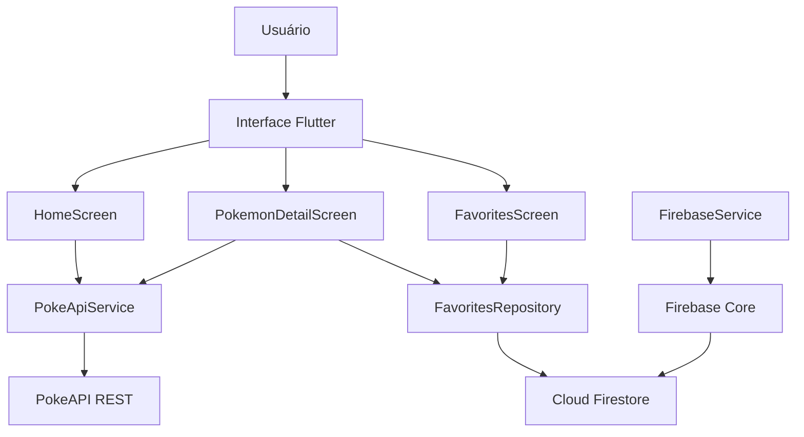

# Pokédex Flutter Firebase

> Desenvolvi uma Pokédex em Flutter que consome a PokeAPI para listar e detalhar Pokémon. A integração com Firebase foi feita usando Cloud Firestore, permitindo salvar Pokémon favoritos em uma coleção chamada `favorite_pokemons`. A aplicação está organizada em camadas, separando modelos, serviços de API, repositório de Firebase, telas e componentes visuais.

## Link do projeto

```txt
https://github.com/souoJAUM/pokedex_flutter_firebase
```

## Link para testar ou baixar APK

```txt
APK: https://drive.google.com/file/d/1l2M8siGpgwhYII3xwkpA7bDw0LNpVngL/view?usp=sharing
Web: https://pokedex-flutter-firebase.web.app/
```

## Funcionalidades

- Listagem de Pokémon consumindo a PokeAPI.
- Busca por nome ou número do Pokémon.
- Tela de detalhes com imagem, tipo, altura, peso, experiência base e habilidades.
- Integração com Firebase Cloud Firestore.
- Cadastro de favoritos no Firestore.
- Tela de favoritos com atualização em tempo real via `StreamBuilder`.
- Remoção de favoritos com gesto de arrastar.
- Organização em camadas: models, services, repositories, screens e widgets.

## Tecnologias utilizadas

- Flutter
- Dart
- PokeAPI
- Firebase Core
- Cloud Firestore
- HTTP package
- Material Design 3

## API utilizada

A aplicação utiliza a PokeAPI, uma API REST aberta com dados de Pokémon.

Endpoints usados:

```txt
GET https://pokeapi.co/api/v2/pokemon?limit=60&offset=0
GET https://pokeapi.co/api/v2/pokemon/{name-or-id}
```

## Integração com Firebase

A integração com Firebase é feita usando:

- `firebase_core`: inicialização do Firebase no Flutter.
- `cloud_firestore`: leitura e gravação dos favoritos no Cloud Firestore.

Coleção usada no Firestore:

```txt
favorite_pokemons
```

Exemplo de documento salvo:

```json
{
  "id": 1,
  "name": "bulbasaur",
  "url": "https://pokeapi.co/api/v2/pokemon/1/",
  "imageUrl": "https://raw.githubusercontent.com/PokeAPI/sprites/master/sprites/pokemon/other/official-artwork/1.png",
  "createdAt": "timestamp"
}
```

## Arquitetura da aplicação



## Estrutura de pastas

```txt
lib/
├── firebase_options.dart
├── main.dart
├── models/
│   └── pokemon.dart
├── repositories/
│   └── favorites_repository.dart
├── screens/
│   ├── favorites_screen.dart
│   ├── home_screen.dart
│   └── pokemon_detail_screen.dart
├── services/
│   ├── firebase_service.dart
│   └── poke_api_service.dart
└── widgets/
    ├── pokemon_card.dart
    └── status_banner.dart
```

## Pré-requisitos

Antes de rodar o projeto, instale:

- Flutter SDK
- Android Studio
- Git
- Firebase CLI
- FlutterFire CLI

Verifique a instalação do Flutter:

```bash
flutter doctor
```

## Como abrir e executar o projeto

### 1. Clonar o repositório

```bash
git https://github.com/souoJAUM/pokedex_flutter_firebase
cd pokedex_flutter_firebase
```

Se você recebeu o projeto por ZIP, extraia a pasta e abra o terminal dentro dela.

### 2. Gerar as pastas nativas do Flutter, se necessário

Caso as pastas `android/`, `ios/` ou arquivos específicos da plataforma não existam, rode:

```bash
flutter create . --platforms=android,web
```

Esse comando gera a estrutura nativa sem apagar o código principal em `lib/`.

### 3. Baixar as dependências

```bash
flutter pub get
```

### 4. Configurar o Firebase

Entre no Firebase Console e crie um projeto. Depois, dentro da pasta do projeto Flutter, rode:

```bash
dart pub global activate flutterfire_cli
flutterfire configure
```

Selecione o projeto Firebase criado e as plataformas desejadas, principalmente Android e Web.

Esse comando deve gerar ou substituir o arquivo:

```txt
lib/firebase_options.dart
```

O arquivo enviado no projeto é apenas um modelo com placeholders. Para o Firestore funcionar de verdade, ele precisa ser substituído pelo arquivo real gerado pelo FlutterFire CLI.

### 5. Criar o banco no Firestore

No Firebase Console:

1. Acesse **Build > Firestore Database**.
2. Clique em **Create database**.
3. Escolha modo de teste para fins acadêmicos.
4. Selecione uma região.
5. Finalize a criação.

Regras temporárias para teste acadêmico:

```txt
rules_version = '2';
service cloud.firestore {
  match /databases/{database}/documents {
    match /{document=**} {
      allow read, write: if true;
    }
  }
}
```

Observação: essas regras são permissivas e servem apenas para teste acadêmico. Em produção, use autenticação e regras restritivas.

### 6. Rodar no navegador

```bash
flutter run -d chrome
```

### 7. Rodar no Android/emulador

Conecte um celular ou abra um emulador no Android Studio. Depois rode:

```bash
flutter devices
flutter run
```

### 8. Gerar APK

```bash
flutter build apk --release
```
